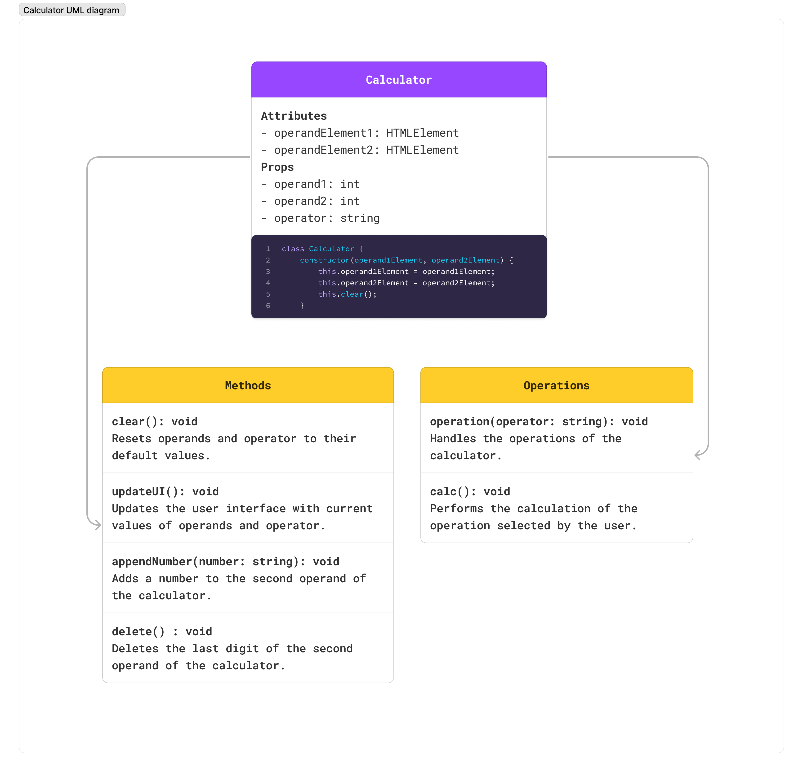

# JS Calculator
This project is a JavaScript calculator class designed to facilitate basic arithmetic operations within web applications. The class provides essential methods to perform calculations and update the user interface dynamically.

## UML Calculator Diagram
Represents the structure and functionality of the `Calculator` class.

## Methods

**Constructor(operand1Element, operand2Element)**

Receives two arguments: `operand1Element` and `operand2Element`, which are DOM elements representing visually the operands in the calculator's user interface. When a new instance of Calculator is created, this constructor initializes the calculator with the DOM elements for the operands, and then calls the `clear()` method to set the initial values of the operands.

**Clear()**

Resets the values of the operands and the operator to their default values. It sets both `operand1` and `operand2` to `0`, and `operator` to an empty string (`''`). It also updates the user interface to reflect these changes.

**UpdateUI()**

Updates the content of the DOM elements `operand1Element` and `operand2Element` with the values of `operand1` and `operand2`, respectively. It also displays the selected operator between `operand1` and `operand2`.

**AppendNumber(number)**

Receives an argument `number`, which is the number to be added to the `operand2`. It checks if `operand2` already contains a decimal point, and if so, it avoids adding another decimal point. If the current value of `operand2` is `0`, it replaces it with the new `number`. Then, it updates `operand2` by concatenating the number to the end of its current value as a string. After it calls the `updateUI()` method to reflect the changes.

**Delete()**

Converts the `operand2` to a string, removes the last character, and then converts the resulting string back to a number. After deletion, it calls the `updateUI()` method.

## Operations

**Operation(operator)**

Takes an `operator`, representing the mathematical operator selected by the user. If there's already an `operator` in use, it calls the calc() method to perform the previous operation. Then, it assigns the new `operator` and prepares the operands for the next operation. Finally, it updates the user interface to reflect the changes.

**Calc()**

Uses the current `operator` and operands to carry out the corresponding mathematical operation. After calculating the result, it updates `operand1` with the result and resets the `operand2` and the `operator`. Finally, it updates the user interface.